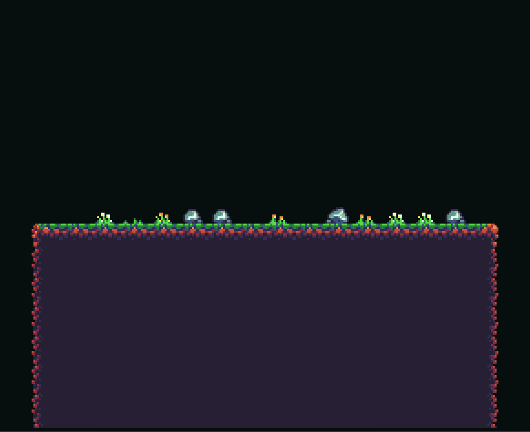
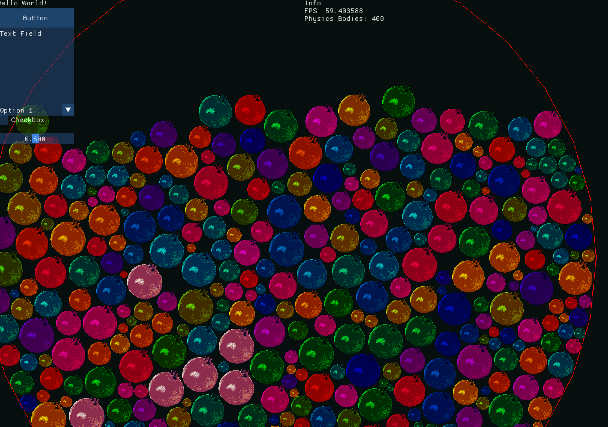
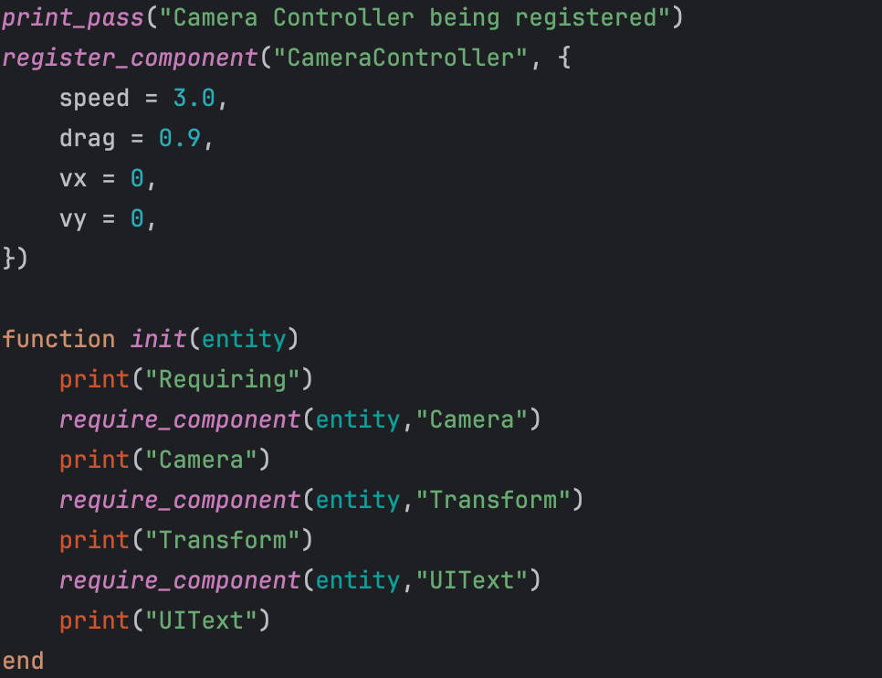

# Pomegranate-Editor
A simple customizable 2D Game Engine. Still WIP.

# About

 *Tilemap Demo*

Pomegranate Engine is a 2D Game Engine written in C++ and SDL2. It is designed to be simple, easy to use, and highly customizable. 
It is currently in a very early stage of development and is not recommended for use in production.

While the engine is currently being developed on Windows. Although it should be possible to build and run on other platforms, 
because there are no windows-specific dependencies. (Although some stuff will have to be changed.)

Currently, it is being developed as a non-graphical, headless engine, in order to make sure that all features are working correctly, and are easy to use.
A graphical editor will be created in the future.

 *Physics Demo*

The engine comes with a Lua Wrapper so that systems/components can be written in lua. This will be more important when the graphical editor is created.

 *Lua Demo*

## Features
- Hybrid GameObject-ECS System
- Lua scripting support
- Physics Engine with Multithreading
- Neat Debugging functions
- 

  
Standard ECS library

    - [x] Transform
    - [x] Transform Links
    - [x] Sprite Renderer
    - [x] Frame Animation Sprite Renderer
    - [x] Collision (Circle Only WIP)
    - [x] Rigidbody
    - [x] Tilemap (No Collision)
    - [x] Debug Circles
    - [x] ImGui UI

## Planned Features
- Graphical Editor
- Optimizations
- Scripting Languages Support ([Teascript](https://github.com/RevengerWizard/teascript), CSharp)
- Shaders/Post Processing
- 2D Lighting
- ECS Standard Library Navigation
- Documentation
- Event System
## Possible Future Features
- 2D Skeletal Animation
- 3D Rendering
- 3D Physics
- Networking

# Building

Figure it out. Good luck! 🥰

# Contribution Guidelines

I need help.

## Bug Reports

If you find any issues or bugs, please check to see if they were already reported in the [issue tracker](https://github.com/Pomegranate-Engine/Pomegranate-Engine/issues). 
If not, please open a new issue with a clear description, steps to reproduce, and any relevant information.

## Feature Requests

If you have ideas for new features or improvements, create a new issue and clearly describe the improvement or feature, 
and if possible, provide examples or use cases.

## Pull Requests

We welcome and appreciate contributions! If you plan to submit a pull request:

1. Fork the repository.
2. Create a new branch for your feature or bug fix.
3. Make your changes, ensuring the code follows our coding standards.
4. Write tests if applicable.
5. Ensure the documentation is updated.
6. Open a pull request, explaining the changes and providing context.

## Coding Standards

- Follow the established coding style and conventions.
- Write clear and concise code with meaningful variable and function names.
- Document your code appropriately to help others understand your contributions.